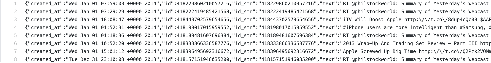
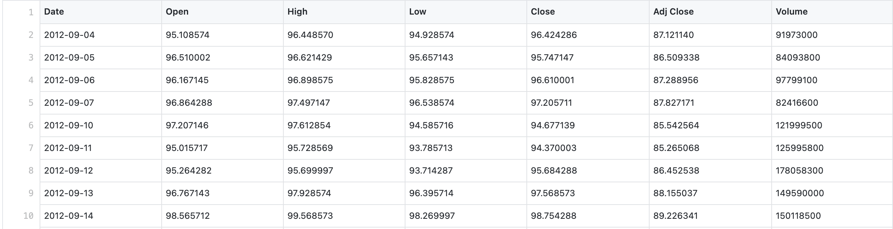
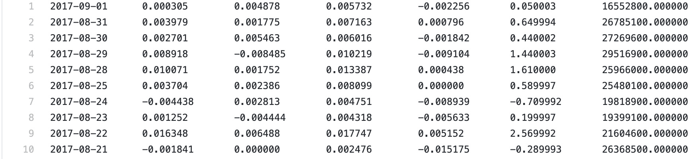
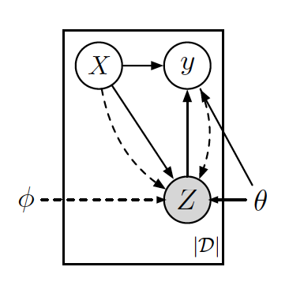
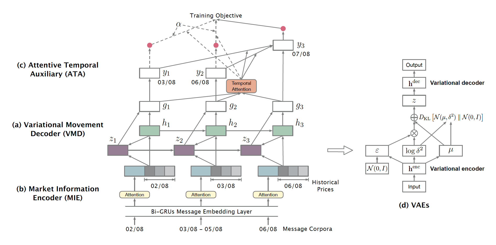
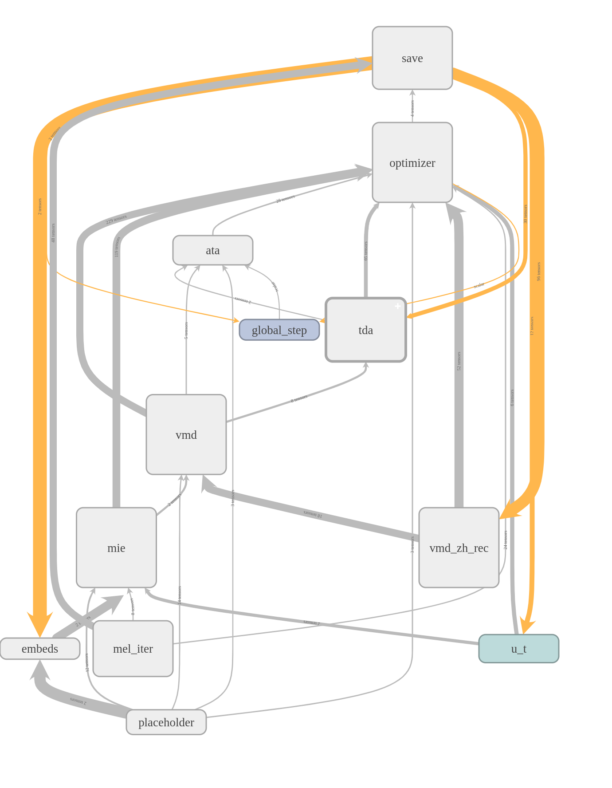
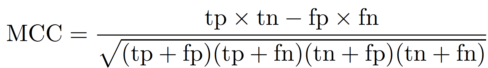
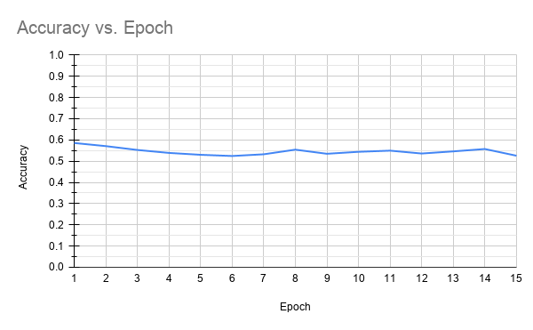
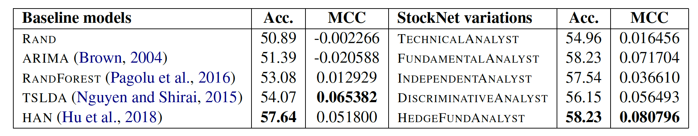
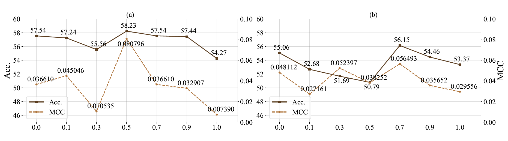

# Stock Movement Prediction from Tweets and Historical Prices

*Stock movement prediction from tweets and historical prices*, Xu, Yumo, and Shay B. Cohen., Proceedings of the 56th Annual Meeting of the Association for Computational Linguistics (Volume 1: Long Papers). 2018.

This is a re-implementation of [StockNet](https://github.com/yumoxu/stocknet-code) in Python 2.7.11, Tensorflow 1.13.1, Scipy 1.0.0, NLTK 3.2.5

By Ugur Demir and Kamalakkannan Ravi

*Submitted to Comp_Sci_396, Winter '21*

**Please click here for the [Video Presentation](https://youtu.be/hAhHGq7Db6c)**

## Overview

In this project, we study the problem of stock movement prediction using Tweets and Historical Stock Prices. We have used the same data as the authors and applied their techniques to predict the stock movement. The following sections introduce and discuss the problem, define it, data collection, methodology, implement them, the evaluation metrics, experiments, results, inference, future work, and takeaway message.

## 1. Introduction

The stock market is a stochastic system and depends on many objective and subjective variables. In this work, we aim to make time-dependent predictions on this stochastic data. To make the prediction, we design a generative model to use both text data from Twitter tweets and the recorded stock price data. The proposed method has a hybrid objective to capture temporal dependencies in the stock data and text data dependencies. 

**We have *successfully* run the code on the given data. The results we obtained is shown the 'Loss and Acc Vs Epoch' plot in the section 7. We also have shown the reported results from the original paper for comparison.**

## 2. Stock Movement Prediction (Problem Definition)

In stock market prediction, the movement prediction is made daily. To make such a prediction, we use the actual historical stock data collected over two years. Further, we augment this data with text data obtained from the social media platform Twitter.

## 3. Data Collection

### 3.1 Twitter Data

Whenever a significant change happens in the stock market, particularly of the high-trade volume stocks, it is reflected on the Twitter tweets. So we access Twitter data via their office Twitter API. We get stock-specific tweets by querying their corresponding NASDAQ ticker symbols, e.g., “APPL” for Apple Inc. The raw tweets for 'AAPL' stock are shown below.



As in Bird et al. (2009), we preprocess tweet texts using the NLTK python library. We do tokenization and hyperlinks treatment, hashtags identification, and “@” identifification. Since it is possible to have no tweet at all for a tweet, we avoid this by having at least one tweet for a stock obtained from the Twitter corpus. The preprocessed tweets for 'AAPL' stock are shown below.

```javascript
{"text": ["rt", "AT_USER", "summary", "of", "yesterday's", "webcast", "featuring", "$", "aapl", "$", "wynn", "$", "goog", "$", "lgf", "tradereducation", "options", "hedgingstrategies", "-", "-", "URL"], "created_at": "Wed Jan 01 03:59:03 +0000 2014", "user_id_str": "1938270918"}
{"text": ["rt", "AT_USER", "summary", "of", "yesterday's", "webcast", "featuring", "$", "aapl", "$", "wynn", "$", "goog", "$", "lgf", "tradereducation", "options", "hedgingstrategies", "-", "-", "URL"], "created_at": "Wed Jan 01 03:29:29 +0000 2014", "user_id_str": "1933063572"}
{"text": ["itv", "will", "boost", "apple", "URL", "$", "aapl", "apple"], "created_at": "Wed Jan 01 18:08:47 +0000 2014", "user_id_str": "23059499"}
{"text": ["iphone", "users", "are", "more", "intelligent", "than", "samsung", ",", "blackberry", "and", "htc", "owners", ",", "$", "aapl", "$", "bbry", ",", "URL"], "created_at": "Wed Jan 01 01:52:31 +0000 2014", "user_id_str": "23954327"}
{"text": ["rt", "AT_USER", "summary", "of", "yesterday's", "webcast", "featuring", "$", "aapl", "$", "wynn", "$", "goog", "$", "lgf", "tradereducation", "options", "hedgingstrategies", "-", "-", "URL"], "created_at": "Wed Jan 01 01:18:36 +0000 2014", "user_id_str": "1937591882"}
{"text": ["2013", "wrap-up", "and", "trading", "set", "review", "-", "part", "iii", "URL", "$", "aapl", "apple", "$", "bp", "$", "cnw", "$", "csco", "$", "csx", "$", "cvx", "$", "goog", "$", "hpq", "$", "ibm", "$", "intc", "$", "ngg"], "created_at": "Wed Jan 01 10:52:20 +0000 2014", "user_id_str": "23059499"}
{"text": ["apple", "screwed", "up", "big", "time", "URL", "$", "amzn", "$", "aapl"], "created_at": "Wed Jan 01 15:01:12 +0000 2014", "user_id_str": "23669783"}
{"text": ["rt", "AT_USER", "summary", "of", "yesterday's", "webcast", "featuring", "$", "aapl", "$", "wynn", "$", "goog", "$", "lgf", "tradereducation", "options", "hedgingstrategies", "-", "-", "URL"], "created_at": "Tue Dec 31 23:10:08 +0000 2013", "user_id_str": "1864753100"}
```

### 3.2 Historical Stock Prices

To make stock market predictions, the historical price data is crucial. In Finance, stocks are categorized into nine industries. So we extract historical prices for the 88 high-trade volume stocks. This historical price dataset is obtained from Yahoo Finance. The nine industries are Basic Materials, Consumer Goods, Healthcare, Services, Utilities, Conglomerates, Financial, Industrial Goods, and Technology. We select the two-year price movements. The period is from 01/01/2014 to 01/01/2016. Of 88 high-trade volume stocks, eight are from all the Conglomerates and the other 80 from the top 10 stores in capital size in each of the other eight industries. The raw historical data and processed data for 'AAPL' stock are shown below.





## 4. How to Define Stock Estimator Model (Model Overview)

In the stock market, the movement prediction on a day requires historical data of that particular stock. Building temporal connections between time-sensitive dates is an issue on model training as it affects the principle of sample independence. But then we observe that we could use other trading days data to simulate the prediction close to 'd'. To do that, we propose trading day alignment where we arrange the historical data prices and tweets. This helps in modeling the conditional probability distribution for multi-task learning.



In the above figure, we show the generative process. Here the market information is encoded as a random variable. Then we synthesize the latent variable for down-the-line prediction tasks. We also offer StockNet's big picture below. This module consists of three bottom-up components: Market Information Encoder, Variational Movement Decoder (VMD), and Attentive Temporal Auxiliary.



```Python
with tf.device('/device:GPU:0'):
    self._build_placeholders()
    self._build_embeds()
    self._build_mie()
    self._build_vmd()
    self._build_temporal_att()
    self._build_ata()
    self._create_optimizer()
```

This code snippet shows how the overall model is created. Since the source code is written with the Tensorflow framework, the first step is to create the input placeholder layer.  The input layer will hold the values for tweeter data and stock history.  To project the raw input data to embedding space, an embedding layer is created. The first layer of the model is built by the *self._build_mie()* function. This will take the embedding vectors and better represent the next layer ‘Variational Movement Decoder (VMD)’. The VMD layer is initiated by the *self._build_vmd()* function where the latent vector Z is learned recurrently. Temporal attention block and the ‘Attentive Temporal Auxilary (ATA)’ are created sequentially following the VMD layer. The last function in this script creates the optimizers and initiates the necessary parameters for the training step. 

We detail next to our model's components (MIE, VMD, ATA) and the way we estimate our model parameters.

### 4.1 Market Information Encoder

MIE encoder is used to encode the social media and stock prices information from a stock. This encoding improves the quality of the market information and produces market information output for VMD. The quality of the tweets is very drastic. Based on the prior work (Hu et al., 2018), we use attention at the news level. In the stock market, the price change decides the stock movement, not its actual price. So we use the adjusted closing price instead of the raw price values. 

The following code snippet shows how the word encoding layer works. The word table is given as a configuration to the script, and a lookup table is initialized with it. This will take the raw values of stock history and tweets; then it will turn them into feature vectors so that the model can process them.

```Python
def _build_embeds(self):
with tf.name_scope('embeds'):
    with tf.variable_scope('embeds'):
        word_table = tf.get_variable('word_table', initializer=self.word_table_init, trainable=False)
        self.word_embed = tf.nn.embedding_lookup(word_table, self.word_ph, name='word_embed')
```

The lookup table produces the embedding vectors used as input to our main model, but bidirectional GRU units can increase their representation capacity. The following script shows how the MIE component is initialized. Depending on the input type, different strategies are followed. 

```Python
def _build_mie(self):
"""
    Create market information encoder.

    corpus_embed: batch_size * max_n_days * corpus_embed_size
    price: batch_size * max_n_days * 3
    => x: batch_size * max_n_days * x_size
"""
with tf.name_scope('mie'):
    self.price = self.price_ph
    self.price_size = 3

    if self.variant_type == 'tech':
        self.x = self.price
        self.x_size = self.price_size
    else:
        self._create_msg_embed_layer_in()
        self._create_msg_embed_layer()
        self._create_corpus_embed()
        if self.variant_type == 'fund':
            self.x = self.corpus_embed
            self.x_size = self.corpus_embed_size
        else:
            self.x = tf.concat([self.corpus_embed, self.price], axis=2)
            self.x_size = self.corpus_embed_size + self.price_size

```

When the prediction model is trained on tech companies, only price information is used as a feature vector. For the other input types (e.g.hedge), the MIE block uses a bidirectional GRU unit for representation learning. The functions *self._create_msg_embed_layer_in()*, *self._create_msg_embed_layer()*, and *self._create_corpus_embed()* are used to initialize GRU units. The output of this unit contains the embedded information about the tweets and historical stock market data. This embedding is passed to the next block, VMD, for the stock movement prediction.

### 4.2 Variational Movement Decoder

The VMD module uses the encoded market information and recurrently infer and decode the latent factor Z, which shows the stock movements' market status. Here we use VAE to fit the latent distribution. Also, VMD uses RNN-GRU to obtain features and recurrently decoding the signals. 

```Python
def _build_vmd(self):
    if self.variant_type == 'discriminative':
        self._create_discriminative_vmd()
    else:
        if self.vmd_rec == 'h':
            self._create_vmd_with_h_rec()
        else:
            self._create_vmd_with_zh_rec()
```

This snippet shows how the *Variational Movement Decoder* is created. In the source code, there are three implementations for this unit. In the paper, the results are reported by the variational version of VMD which is implemented by the *self._create_vmd_with_zh_rec()* function.

```Python
with tf.name_scope('vmd'):
    with tf.variable_scope('vmd_zh_rec', reuse=tf.AUTO_REUSE):
        x = tf.nn.dropout(self.x, keep_prob=1-self.dropout_vmd_in)

        self.mask_aux_trading_days = tf.sequence_mask(self.T_ph - 1, self.max_n_days, dtype=tf.bool,
                                                      name='mask_aux_trading_days')

        if self.vmd_cell_type == 'ln-lstm':
            cell = tf.contrib.rnn.LayerNormBasicLSTMCell(self.h_size)
        else:
            cell = tf.contrib.rnn.GRUCell(self.h_size)
        cell = tf.contrib.rnn.DropoutWrapper(cell, output_keep_prob=1.0-self.dropout_vmd)

        init_state = None
        # calculate vmd_h, batch_size * max_n_days * vmd_h_size
        h_s, _ = tf.nn.dynamic_rnn(cell, x, sequence_length=self.T_ph, initial_state=init_state, dtype=tf.float32)

        # forward max_n_days
        x = tf.transpose(x, [1, 0, 2])  # max_n_days * batch_size * x_size
        h_s = tf.transpose(h_s, [1, 0, 2])  # max_n_days * batch_size * vmd_h_size
        y_ = tf.transpose(self.y_ph, [1, 0, 2])  # max_n_days * batch_size * y_size

        def _loop_body(t, ta_z_prior, ta_z_post, ta_kl):
            """
                iter body. iter over trading days.
            """
            with tf.variable_scope('iter_body', reuse=tf.AUTO_REUSE):

                init = lambda: tf.random_normal(shape=[self.batch_size, self.z_size], name='z_post_t_1')
                subsequent = lambda: tf.reshape(ta_z_post.read(t-1), [self.batch_size, self.z_size])

                z_post_t_1 = tf.cond(t >= 1, subsequent, init)

                with tf.variable_scope('h_z_prior'):
                    h_z_prior_t = self._linear([x[t], h_s[t], z_post_t_1], self.z_size, 'tanh')
                with tf.variable_scope('z_prior'):
                    z_prior_t, z_prior_t_pdf = self._z(h_z_prior_t, is_prior=True)

                with tf.variable_scope('h_z_post'):
                    h_z_post_t = self._linear([x[t], h_s[t], y_[t], z_post_t_1], self.z_size, 'tanh')
                with tf.variable_scope('z_post'):
                    z_post_t, z_post_t_pdf = self._z(h_z_post_t, is_prior=False)

            kl_t = ds.kl_divergence(z_post_t_pdf, z_prior_t_pdf)  # batch_size * z_size

            ta_z_prior = ta_z_prior.write(t, z_prior_t)  # write: batch_size * z_size
            ta_z_post = ta_z_post.write(t, z_post_t)  # write: batch_size * z_size
            ta_kl = ta_kl.write(t, kl_t)  # write: batch_size * 1

            return t + 1, ta_z_prior, ta_z_post, ta_kl

        # loop_init
        ta_z_prior_init = tf.TensorArray(tf.float32, size=self.max_n_days)
        ta_z_post_init = tf.TensorArray(tf.float32, size=self.max_n_days, clear_after_read=False)
        ta_kl_init = tf.TensorArray(tf.float32, size=self.max_n_days)

        loop_init = (0, ta_z_prior_init, ta_z_post_init, ta_kl_init)
        cond = lambda t, *args: t < self.max_n_days

        _, ta_z_prior, ta_z_post, ta_kl = tf.while_loop(cond, _loop_body, loop_init)

        z_shape = (self.max_n_days, self.batch_size, self.z_size)
        z_prior = tf.reshape(ta_z_prior.stack(), shape=z_shape)
        z_post = tf.reshape(ta_z_post.stack(), shape=z_shape)
        kl = tf.reshape(ta_kl.stack(), shape=z_shape)

        h_s = tf.transpose(h_s, [1, 0, 2])  # batch_size * max_n_days * vmd_h_size
        z_prior = tf.transpose(z_prior, [1, 0, 2])  # batch_size * max_n_days * z_size
        z_post = tf.transpose(z_post, [1, 0, 2])  # batch_size * max_n_days * z_size
        self.kl = tf.reduce_sum(tf.transpose(kl, [1, 0, 2]), axis=2)  # batch_size * max_n_days

        with tf.variable_scope('g'):
            self.g = self._linear([h_s, z_post], self.g_size, 'tanh')  # batch_size * max_n_days * g_size

        with tf.variable_scope('y'):
            self.y = self._linear(self.g, self.y_size, 'softmax')  # batch_size * max_n_days * y_size

        sample_index = tf.reshape(tf.range(self.batch_size), (self.batch_size, 1), name='sample_index')

        self.indexed_T = tf.concat([sample_index, tf.reshape(self.T_ph-1, (self.batch_size, 1))], axis=1)

        def _infer_func():
            g_T = tf.gather_nd(params=self.g, indices=self.indexed_T)  # batch_size * g_size

            if not self.daily_att:
                y_T = tf.gather_nd(params=self.y, indices=self.indexed_T)  # batch_size * y_size
                return g_T, y_T

            return g_T

        def _gen_func():
            # use prior for g & y
            z_prior_T = tf.gather_nd(params=z_prior, indices=self.indexed_T)  # batch_size * z_size
            h_s_T = tf.gather_nd(params=h_s, indices=self.indexed_T)

            with tf.variable_scope('g', reuse=tf.AUTO_REUSE):
                g_T = self._linear([h_s_T, z_prior_T], self.g_size, 'tanh', use_bn=False)

            if not self.daily_att:
                with tf.variable_scope('y', reuse=tf.AUTO_REUSE):
                    y_T = self._linear(g_T, self.y_size, 'softmax')
                return g_T, y_T

            return g_T

        if not self.daily_att:
            self.g_T, self.y_T = tf.cond(tf.equal(self.is_training_phase, True), _infer_func, _gen_func)
        else:
            self.g_T = tf.cond(tf.equal(self.is_training_phase, True), _infer_func, _gen_func)

```

The main component of the VMD is implemented in two different ways *GRUCell* and *LayerNormBasicLSTMCell*. Since the *GRUCell* implementation is giving better results, experiments are conducted with GRU implementation.


### 4.3 Attentive Temporal Auxiliary

Attentive Temporal Auxilary park consists of two main blocks. The first part is the *shared temporal attention unit* which is implemented by the following code snippet;

```Python
def _build_temporal_att(self):
    """
        g: batch_size * max_n_days * g_size
        g_T: batch_size * g_size
    """
    with tf.name_scope('tda'):
        with tf.variable_scope('tda'):
            with tf.variable_scope('v_i'):
                proj_i = self._linear([self.g], self.g_size, 'tanh', use_bias=False)
                w_i = tf.get_variable('w_i', shape=(self.g_size, 1), initializer=self.initializer)
            v_i = tf.reduce_sum(tf.tensordot(proj_i, w_i, axes=1), axis=-1)  # batch_size * max_n_days

            with tf.variable_scope('v_d'):
                proj_d = self._linear([self.g], self.g_size, 'tanh', use_bias=False)
            g_T = tf.expand_dims(self.g_T, axis=-1)  # batch_size * g_size * 1
            v_d = tf.reduce_sum(tf.matmul(proj_d, g_T), axis=-1)  # batch_size * max_n_days

            aux_score = tf.multiply(v_i, v_d, name='v_stared')
            ninf = tf.fill(tf.shape(aux_score), np.NINF)
            masked_aux_score = tf.where(self.mask_aux_trading_days, aux_score, ninf)
            v_stared = tf.nn.softmax(masked_aux_score)

            # v_stared: batch_size * max_n_days
            self.v_stared = tf.where(tf.is_nan(v_stared), tf.zeros_like(v_stared), v_stared)

            if self.daily_att == 'y':
                context = tf.transpose(self.y, [0, 2, 1])  # batch_size * y_size * max_n_days
            else:
                context = tf.transpose(self.g, [0, 2, 1])  # batch_size * g_size * max_n_days

            v_stared = tf.expand_dims(self.v_stared, -1)  # batch_size * max_n_days * 1
            att_c = tf.reduce_sum(tf.matmul(context, v_stared), axis=-1)  # batch_size * g_size / y_size
            with tf.variable_scope('y_T'):
                self.y_T = self._linear([att_c, self.g_T], self.y_size, 'softmax')
```

This will help the model to utilize a temporally close hypothesis for the prediction day. 

The next code snippet calculates the auxiliary loss that is obtained from other training days. It also learns the temporal importance of the auxiliary terms. 

```Python
def _create_generative_ata(self):
    """
         calculate loss.

         g: batch_size * max_n_days * g_size
         y: batch_size * max_n_days * y_size
         kl_loss: batch_size * max_n_days
         => loss: batch_size
    """
    with tf.name_scope('ata'):
        with tf.variable_scope('ata'):
            v_aux = self.alpha * self.v_stared  # batch_size * max_n_days

            minor = 0.0  # 0.0, 1e-7
            likelihood_aux = tf.reduce_sum(tf.multiply(self.y_ph, tf.log(self.y + minor)), axis=2)  # batch_size * max_n_days

            kl_lambda = self._kl_lambda()
            obj_aux = likelihood_aux - kl_lambda * self.kl  # batch_size * max_n_days

            # deal with T specially, likelihood_T: batch_size, 1
            self.y_T_ = tf.gather_nd(params=self.y_ph, indices=self.indexed_T)  # batch_size * y_size
            likelihood_T = tf.reduce_sum(tf.multiply(self.y_T_, tf.log(self.y_T + minor)), axis=1, keep_dims=True)

            kl_T = tf.reshape(tf.gather_nd(params=self.kl, indices=self.indexed_T), shape=[self.batch_size, 1])
            obj_T = likelihood_T - kl_lambda * kl_T

            obj = obj_T + tf.reduce_sum(tf.multiply(obj_aux, v_aux), axis=1, keep_dims=True)  # batch_size * 1
            self.loss = tf.reduce_mean(-obj, axis=[0, 1])

```


## 5. How to Train Stock Estimator Model

We implement this proposed approach using the Tensorflow framework. The execution graph of the model obtained from TensorBoard is shown below.



The experiments are conducted on Ubuntu 20.04 LTS operating system. The computer we used has an I7 10700k CPU, 32GB memory, and an NVIDIA Titan Xp 12GB GPU. In order to train the model, the following required libraries have to be installed;

* Python 2.7.11
* Tensorflow 1.4.0 or Tensorflow 1.13.1
* Scipy 1.0.0
* NLTK 3.2.5

The specified pre-built Tensorflow 1.4.0 only works with CUDA 8.0. This CUDA version is not compatible with Ubuntu 20.04 operating system. We used CUDA 10.0 with appropriate NVIDIA drivers and installed Tensorflow 1.13.1 to solve compatibility issues and successfully run the training script. The original training script had some problems where there are missing folders. These issues are resolved before starting the experiments. To run the script, the dataset collected for this study has to be downloaded from [stocknet-dataset](https://github.com/yumoxu/stocknet-dataset) and placed under *data* folder. The pre-trained word embeddings have to be downloaded from [GloVe](https://github.com/stanfordnlp/GloVe) and it should be placed under *res* folder. After completing the environment setup described above, to run the training and evaluation code this script can be used.

```
CUDA_VISIBLE_DEVICES=0 python Main.py
```

## 6. How Evaluate

To compare with the literature (Xie et al., 2013; Ding et al., 2015), Matthews Correlation Coefficient (MCC) is used along with accuracy as the evaluation metrics.



## 7. Experiments and Results

**The accuracy plot with respect to training Epochs is shown in Figure below for our model in *HEDGEFUNDANALYST* variant.**



Performance of baselines and StockNet variations in accuracy and MCC are shown in the Table below from the original paper for comparsion.



Performance of 'HEDGEFUNDANALYST' and 'DISCRIMINATIVEANALYST' with varied alpha are shown below from the original paper for comparsion.



## 8. Conclusion

As we infer from the "accuracy Vs epoch" plot, the best accuracy 58.59% at the end of the first epoch. Then as per the original paper, we continued the training until 15 epochs. This, however, didn't improve the accuracy, as we observe from the above plots and tables. The accuracy fluctuated between 0.5 and 0.6. Although the absolute accuracy is lower than the reported result, we obtained better accuracy than the original paper's reported accuracy. This flat trend in the accuracy curve shows that the model is more complex than the data space. With a larger dataset, the model may learn better representation and perform better at testing. 

## 9. Contact Information

If you have any query, please open an issue in this repository. You may also contact us at [kamalakkannanravi2023@u.northwestern.edu](mailto:kamalakkannanravi2023@u.northwestern.edu) or [ugurdemir2023@u.northwestern.edu](mailto:ugurdemir2023@u.northwestern.edu).

Thanks for your interest! Have fun!

## 10. Citation

If you use our codes, please cite the original [paper](https://www.aclweb.org/anthology/P18-1183/) accordingly:

```
@inproceedings{xu-cohen-2018-stock,
    title = "Stock Movement Prediction from Tweets and Historical Prices",
    author = "Xu, Yumo  and
      Cohen, Shay B.",
    booktitle = "Proceedings of the 56th Annual Meeting of the Association for Computational Linguistics (Volume 1: Long Papers)",
    month = jul,
    year = "2018",
    address = "Melbourne, Australia",
    publisher = "Association for Computational Linguistics",
    url = "https://www.aclweb.org/anthology/P18-1183",
    doi = "10.18653/v1/P18-1183",
    pages = "1970--1979"
}
```

All the materials released in this library can **ONLY** be used for **RESEARCH** purposes.

The authors and their institution preserve the copyright and all legal rights of these codes.
